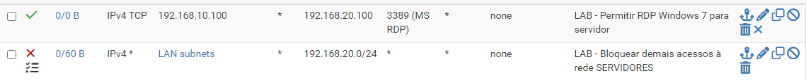

# Laboratório de Segmentação de Rede com pfSense

Laboratório prático desenvolvido no VirtualBox para estudar firewall, segmentação de redes, controle de acesso entre sub-redes e análise de logs.

## Objetivo do projeto

Configurar o pfSense para controlar a comunicação entre uma rede de clientes e uma rede de servidores, permitindo somente o tráfego necessário e preservando o acesso à internet.

## Tecnologias utilizadas

- Oracle VirtualBox
- pfSense CE 2.8.1
- Windows 7 — cliente de teste
- Windows Server 2025 — servidor de destino
- IPv4, TCP/IP e DNS
- Firewall do pfSense e Firewall do Windows

## Arquitetura do laboratório

| Componente | Endereço IP | Função |
|---|---|---|
| pfSense — LAN | `192.168.10.1` | Gateway da rede de clientes |
| Windows 7 | `192.168.10.100` | Cliente de teste |
| pfSense — SERVIDORES | `192.168.20.1` | Gateway da rede de servidores |
| Windows Server 2025 | `192.168.20.100` | Servidor de destino |

As redes LAN e SERVIDORES foram implementadas como segmentos de rede separados no VirtualBox, com o pfSense realizando o roteamento entre elas.

> Observação: neste laboratório, os segmentos são redes distintas do VirtualBox. A configuração não representa, por si só, uma VLAN 802.1Q com trunk e tagging.

## Configurações implementadas

### 1. Controle de acesso no pfSense

Foi criada uma regra para permitir RDP do Windows 7 para o Windows Server:

- Origem: `192.168.10.100`
- Destino: `192.168.20.100`
- Protocolo: TCP
- Porta de destino: `3389`
- Ação: Pass

Também foi criada uma regra de bloqueio para o tráfego IPv4 da LAN com destino à rede `192.168.20.0/24`, posicionada abaixo da permissão específica de RDP e acima da regra geral de permissão da LAN.

Evidência das regras configuradas no pfSense

### 2. Firewall do Windows Server

- Serviço Remote Desktop Services iniciado.
- Conexões de Área de Trabalho Remota habilitadas.
- Regra de entrada TCP 3389 limitada ao endereço IP do Windows 7.
- Perfil de firewall Public utilizado na regra do laboratório.

### 3. Análise de logs

O registro do firewall foi utilizado para verificar o bloqueio de uma tentativa de conexão TCP da LAN para a porta 80 do servidor.

## Testes e resultados

| Teste | Resultado |
|---|---|
| Conexão TCP à porta 3389 | Sucesso |
| Sessão real de Área de Trabalho Remota | Sucesso |
| Tentativa TCP para a porta 80 | Bloqueada pelo pfSense |
| Identificação da regra responsável nos logs | Confirmada |
| Ping para `8.8.8.8` | Sucesso |
| Resolução DNS com `nslookup` | Sucesso |

## Aprendizados

- Criação e ordenação de regras de firewall.
- Controle de acesso por endereço IP, protocolo e porta.
- Comunicação entre sub-redes IPv4.
- Configuração do Firewall do Windows.
- Diagnóstico de conectividade TCP/IP.
- Análise de logs para identificação de tráfego bloqueado.
- Aplicação do princípio do menor privilégio.

## Conclusão

O laboratório demonstrou como restringir o acesso entre redes, permitindo um serviço específico e bloqueando outros acessos IPv4 ao segmento de servidores.

Os testes realizados validaram a conexão RDP, o bloqueio da porta TCP 80, o acesso à internet e a resolução DNS.

## Ambiente

Projeto educacional executado em máquinas virtuais. As configurações devem ser reavaliadas antes de qualquer uso em produção, incluindo regras IPv6, serviços necessários e requisitos de segurança.

## Autor

Projeto pessoal de estudos em infraestrutura de redes e segurança da informação.
